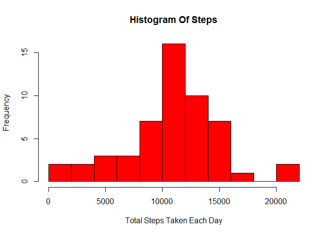
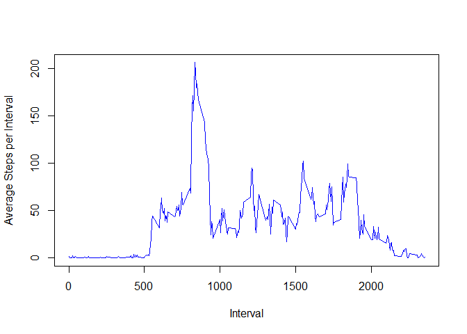
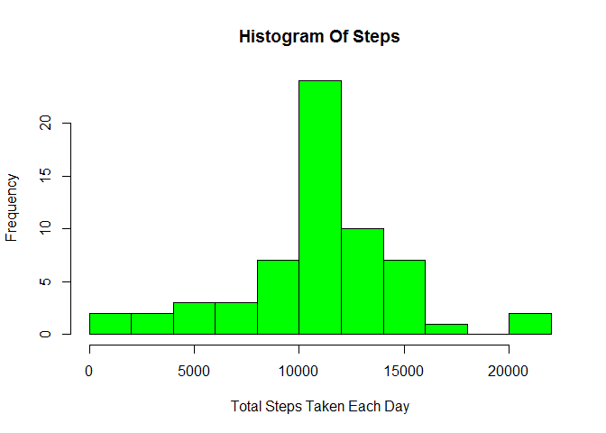
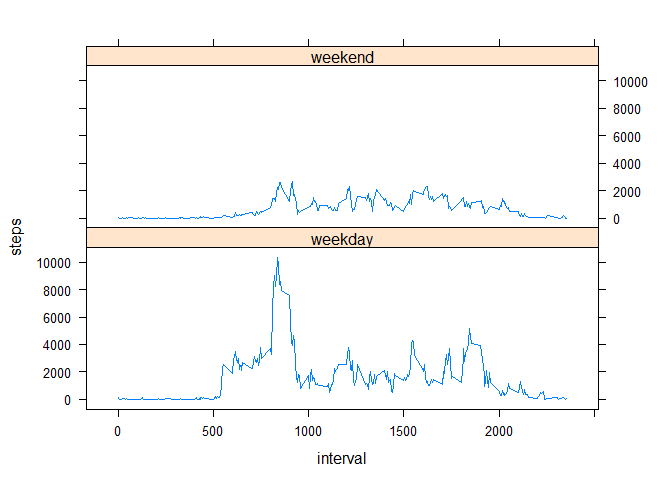

# Reproducible Research: Peer Assessment 1

## Loading and preprocessing the data

The Following code load the data from the activity.csv and process the data  


```r
data <- read.csv('activity.csv')
data$date <- as.Date(data$date)
```


## What is mean total number of steps taken per day?

1.Histogram of Total Number of Steps taken per day ignoring NA values:  


```r
new_data <- data[!is.na(data$steps),]
agg <- aggregate(steps~date,new_data,sum)
hist(agg$steps,col='red',breaks=10,main="Histogram Of Steps",xlab='Total Steps Taken Each Day')
```

 

2.The Calculations of Mean and Median :  


```r
men <- mean(agg$steps)
med <- median(agg$steps)
cat('Mean is ',men,'and Median is ',med)
```

```
## Mean is  10766.19 and Median is  10765
```


## What is the average daily activity pattern?

1.Time series plot of the 5-minute interval (x-axis) and the average number of steps taken, averaged across all days (y-axis) :  


```r
agg2 <- aggregate(steps~interval,new_data,mean)
plot(agg2$interval,agg2$steps,type='l',col='blue',xlab='Interval',ylab='Average Steps per Interval')
```

 

2.The 5-minute interval with max value ageraged over days :  


```r
maxint <- agg2$interval[which.max(agg2$steps)]
cat('The 5-minute interval having maximum steps averaged accross all days is',maxint )
```

```
## The 5-minute interval having maximum steps averaged accross all days is 835
```


## Inputing missing values

1. Total number of missing values in the dataset :  


```r
mval <- sum(is.na(data$steps))
cat('Total number of missing values in the dataset is ', mval)
```

```
## Total number of missing values in the dataset is  2304
```

2,3. Missing data is filled in by the mean of the corresponding interval accross the days.  


```r
meanval <- data.frame(round(agg2$steps),row.names=agg2$interval)
len <- dim(data)[1]
for(i in 1:len)
{
    if(is.na(data$steps[i]))
    {
        data$steps[i] <- meanval[as.character(data$interval[i]),1]
    }
}
```
  
4. Histogram of steps with mean and median.  


```r
agg <- aggregate(steps~date,data,sum)
hist(agg$steps,col='green',breaks=10,main="Histogram Of Steps",xlab='Total Steps Taken Each Day')
```

 

```r
men2 <- mean(agg$steps)
med2 <- as.integer(median(agg$steps))
cat('Mean  is ',men2,'and Median is ',med2)
```

```
## Mean  is  10765.64 and Median is  10762
```

The values of Mean and Median differs from the first unchanged data slightly.  
Change of Mean : **1.0766189\times 10^{4}  ->  1.0765639\times 10^{4}**  
Change of Median : **10765 -> 10762**  

## Are there differences in activity patterns between weekdays and weekends?
  
1. Creating a new factor variable in the dataset with two levels - "weekday"
and "weekend".  


```r
data$date <- weekdays(data$date)
data$date <- as.factor(ifelse(data$date=="Sunday" | data$date=="Saturday","weekend","weekday"))
```
  
2. Creating a 2 Panel Plot for steps in weekdays and weekends.  
  

```r
agg <- aggregate(steps~interval+date,data,sum)
library(lattice)
xyplot(steps~interval|date,data=agg,type='l',layout=c(1,2))
```

 
